# Jarkom_Modul1_Lapres_B04
Kelompok B04
- Syubban Fakhriya 05111840000042
- Feraldy Nathanael 05111840000166
<br/>

# Display Filter

**Soal 1**
> Sebutkan webserver yang digunakan pada "testing.mekanis.me"!

Filter paket yang berasal atau menuju testing.mekanis.me dengan sintaks

```
http.post == "testing.mekanis.me"
```
Kemudian klik kanan pada salah satu paket kemudian klik follow -> tcp stream

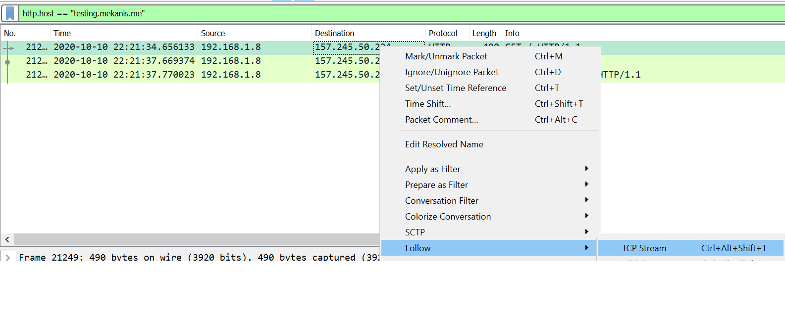

Webserver tertulis dengan nama server sebagai berikut

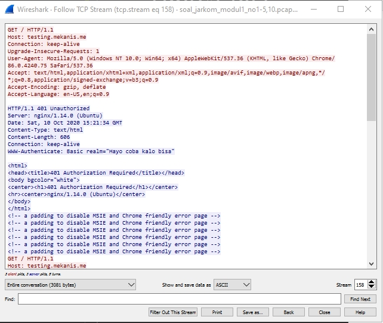

```
Server: nginx/1.14.0 (Ubuntu)
```

<br/>

**Soal 2**
> Simpan gambar "Tim_Kunjungan_Kerja_BAKN_DPR_RI_ke_Sukabumi141436.jpg"!

Untuk soal ini, kita bisa langsung melakukan/memilih opsi File -> Export Object -> HTTP

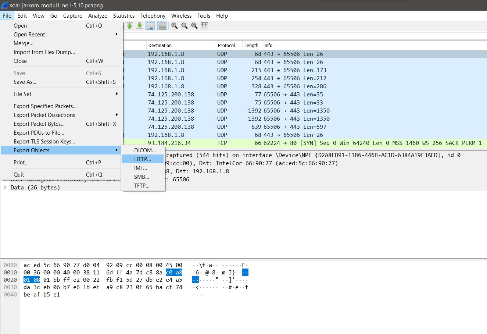

Selanjutnya akan muncul window baru. Pada window tersebut, kita bisa memanfaatkan fitur text filter dan mengetikan nama file yang ingin di save/dicari.
Untuk menyimpan file kita bisa langsung memilih file yang diinginkan dan menekan tombol save.

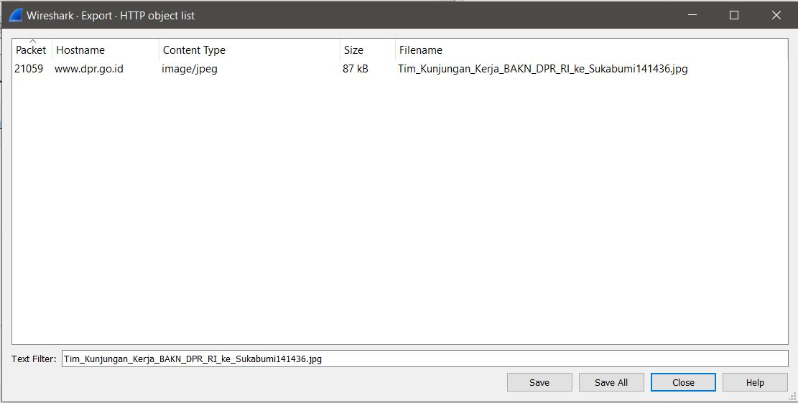
<br/>

**Soal 3**
> Cari username dan password ketika login di "ppid.dpr.go.id"!

Untuk soal ini kita lakukan filter dengan sintaks
```
http.post == "ppid.dpr.go.id"
```
karena kita mencari username dan password (http method post), kita gabung sintaksnya untuk melakukan filter http dan method post maka sintaks akan menjadi

```
http.post == "ppid.dpr.go.id" && http.request.method == "POST"
```

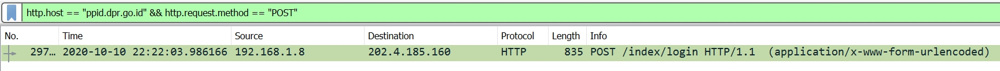

Informasi mengenai login didapat melalui detail paket seperti berikut

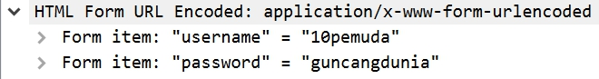

<br/>

**Soal 4**
> Temukan paket dari web-web yang menggunakan basic authentication method!

Untuk melakukan filter digunakan sintaks

```
http.authorization contains "Basic"
```
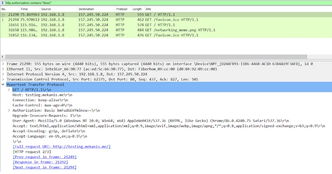


**Soal 5**
> Ikuti perintah di aku.pengen.pw! Username dan password bisa didapatkan dari file .pcapng!

Pertama kita lakukan filter terhadap IP address 157.245.50.224
kemudian kita dapat paket dengan protokol http dan method get

```
ip.addr == 157.245.50.224
```

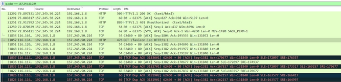

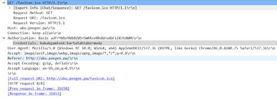

DIkarenakan menggunakan authorization Basic, maka username dan password yang dimasukan dapat terlihat yaitu kakakgamtenk dan hartatahtabermuda.

Setelah memasukan username dan password terbuka halaman yang meminta kita memasukan urutan konfigurasi kabel T568B

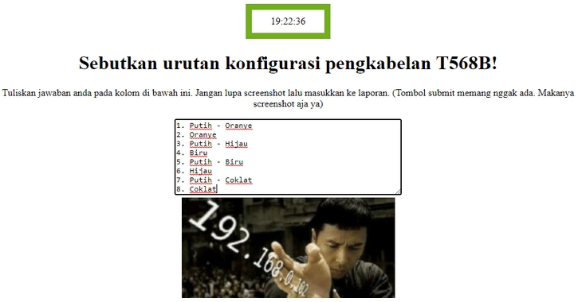

**Soal 6**
> Seseorang menyimpan file zip melalui FTP dengan nama "Answer.zip". Simpan dan Buka file "Open This.pdf" di Answer.zip. Untuk mendapatkan password zipnya, temukan dalam file zipkey.txt (passwordnya adalah isi dari file txt tersebut).

Langkah pertama kita mencari Answer.zip dengan perintah

```
ftp-data.command contains "Answer.zip" 
```

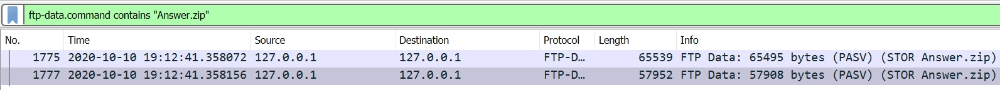

karena ada 2 paket, kita pilih yang paling panjang lalu follow --> tcp stream dan save as raw dengan nama Answer.zip

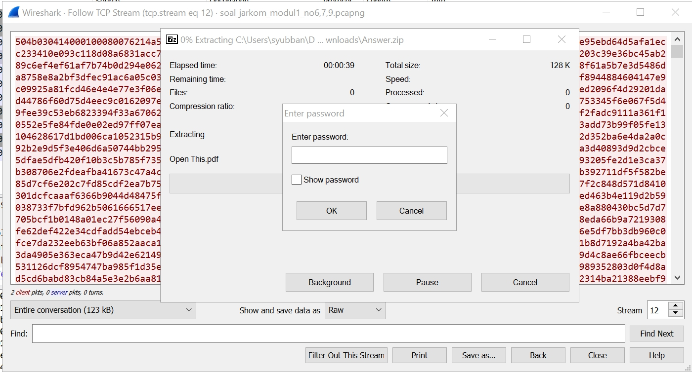

karena zip nya terenkripsi kita cari password nya di zipkey.txt dengan perintah

```
ftp-data.command contains "zipkey.txt" 
```

outputnya akan seperti berikut

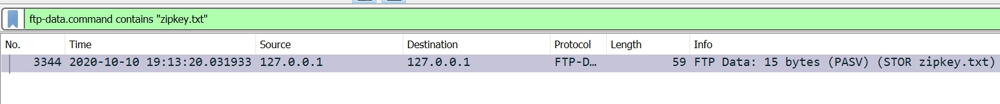

kemudian kita follow --> tcp stream --> ganti show and save data as menjadi ascii akan terlihat isi dari file zipkey.txt

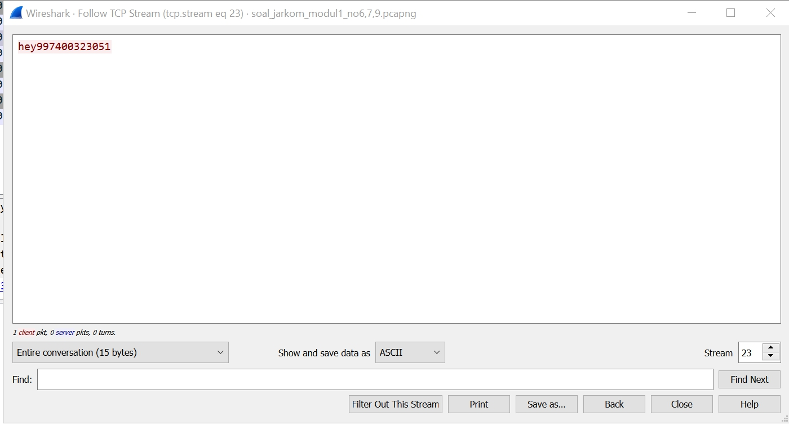

lalu kita masukkan password dari answer.zip dan akan ada file open this.pdf. Isi dari file tersebut adalah

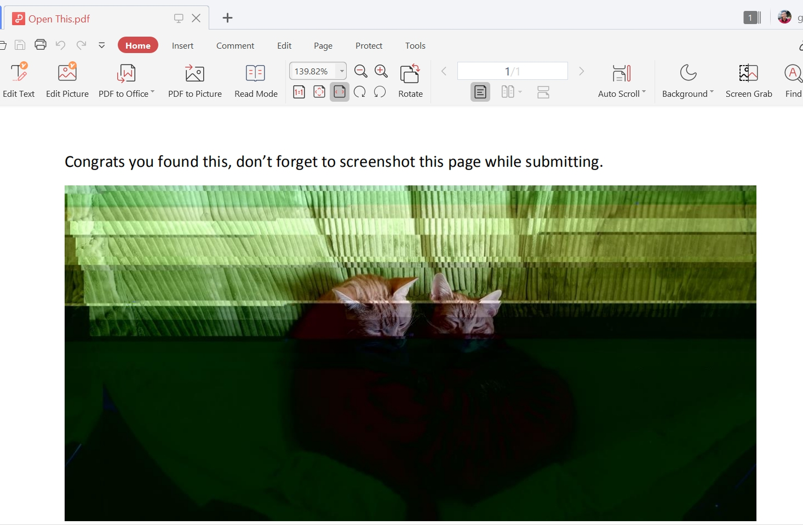

**Soal 7**
> Ada 500 file zip yang disimpan ke FTP Server dengan nama 1.zip, 2.zip, ..., 500.zip. Salah satunya berisi pdf yang berisi puisi. Simpan dan Buka file pdf tersebut.
Your Super Mega Ultra Rare Hint = nama pdf-nya "Yes.pdf"

Untuk mencari file dengan nama tertentu kita bisa memakai perintah

```
frame contains "Yes.pdf"
```

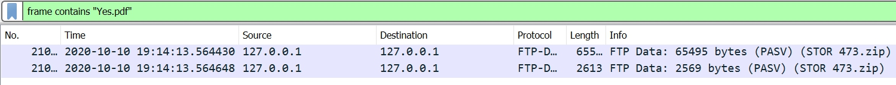

terdapat dua output paket, disini kita mengambil paket terpanjang kemudan kita follow --> tcp stream
--> rubah show and save data as menjadi raw

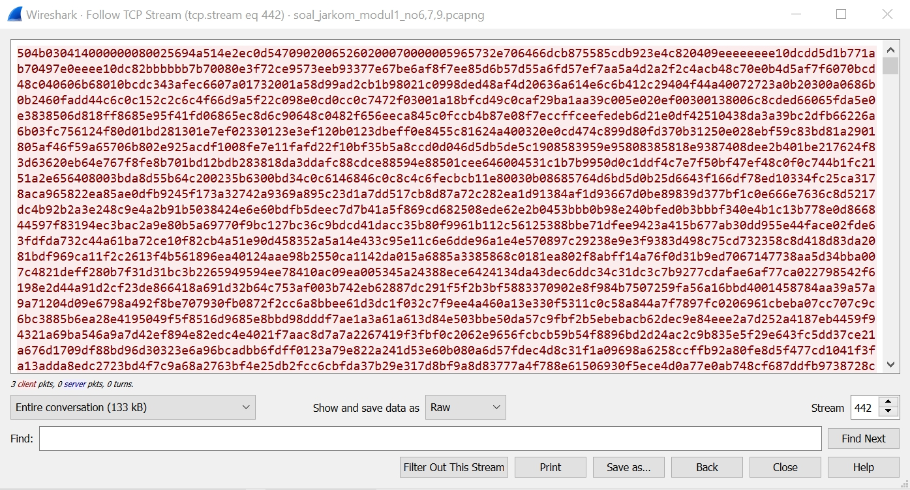

kemudian save dengan nama coba.zip, ekstrak zip tersebut lalu buka yes.pdf

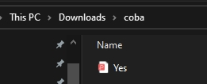

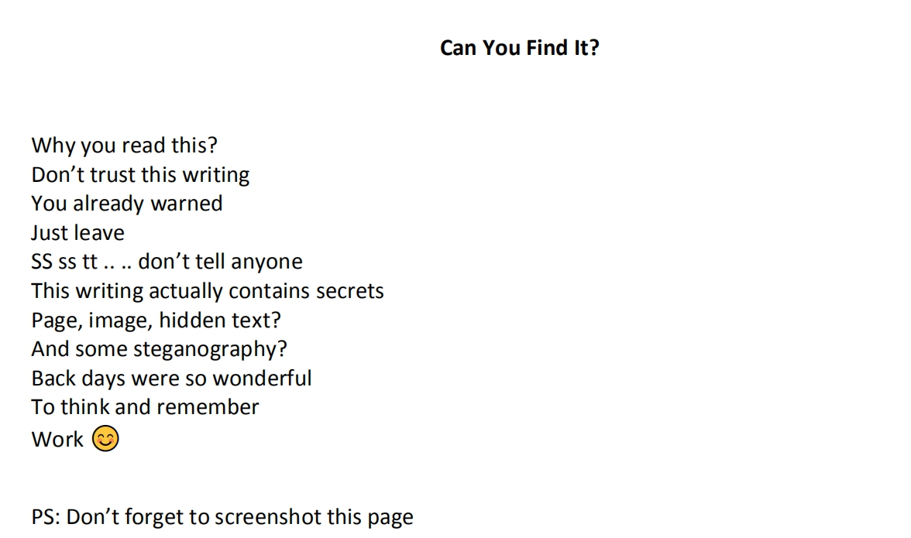

**Soal 8**
> Cari objek apa saja yang didownload (RETR) dari koneksi FTP dengan Microsoft FTP Service!

Langkah pertama kita filter request ftp dengan perintah

```
ftp.request.command contains "RETR"
```

akan didapatkan output seperti berikut

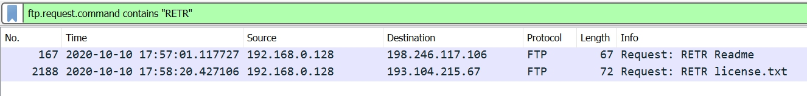

**Soal 9**
> Cari username dan password ketika login FTP pada localhost!

Langkah pertama kita ketikkan perintah berikut

```
ftp.request.command contains "USER" || ftp.request.command contains "PASS"
```

perintah pertama digunakan untuk mencari paket ftp yang memiliki informasi tentang request username lalu perintah kedua untuk password, digunakan or karena kita akan menampilkan hasil dari dua paket yang terpisah

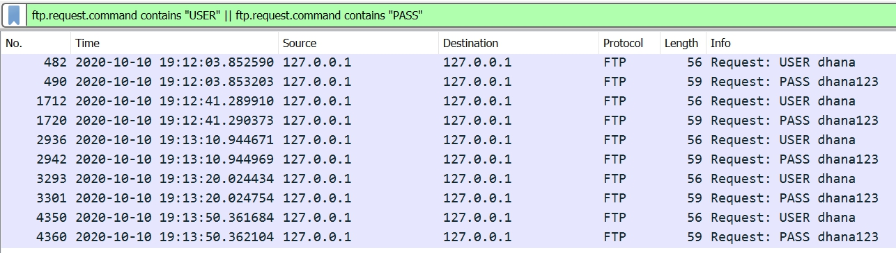

**Soal 10**
> Cari file .pdf di wireshark lalu download dan buka file tersebut!
clue: "25 50 44 46" 

Langkah pertama kita masukkan perintah

```
frame contains 25.50.44.46
```

akan memiliki output seperti ini

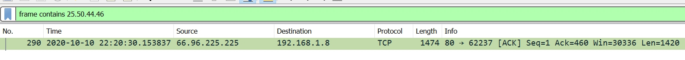

kemudian pilih paket tersebut lalu follow --> tcp stream dan ganti show data and save as menjadi raw

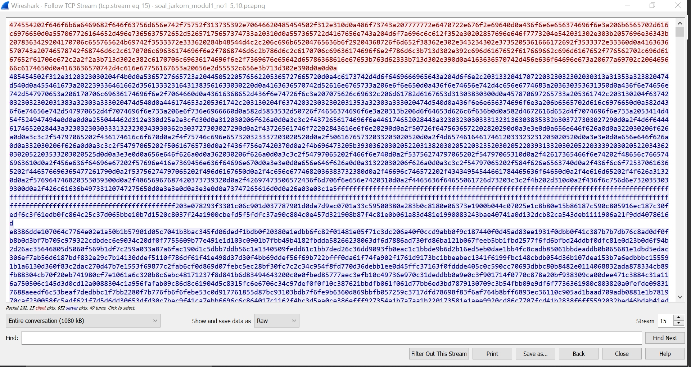

Kemudian kita save as pdf dan akan ada file yang isinya seperti berikut

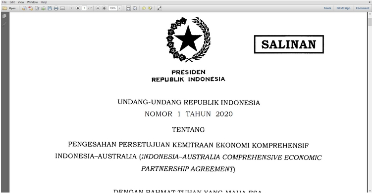

# Capture Filter

**Soal 11**
> Filter sehingga wireshark hanya mengambil paket yang mengandung port 21!

Untuk melakukan filter perintahnya sebagai berikut

```
tcp port 21 and host test.rebex.net
```

disini kita lakukan filter terhadap website ftp tester gratis bernama rebex


**Soal 12**
> Filter sehingga wireshark hanya mengambil paket yang berasal dari port 80!

Untuk melakukan filter perintahnya sebagai berikut

```
src port 80
```

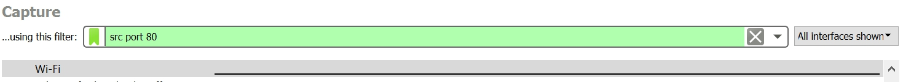
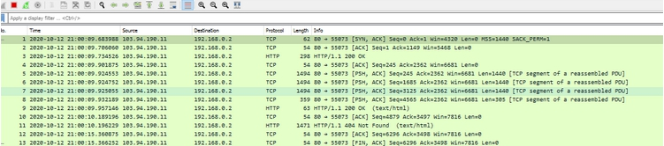

**Soal 13**
> Filter sehingga wireshark hanya menampilkan paket yang menuju port 443!

Untuk melakukan filter digunakan perintah

```
dst port 443
```


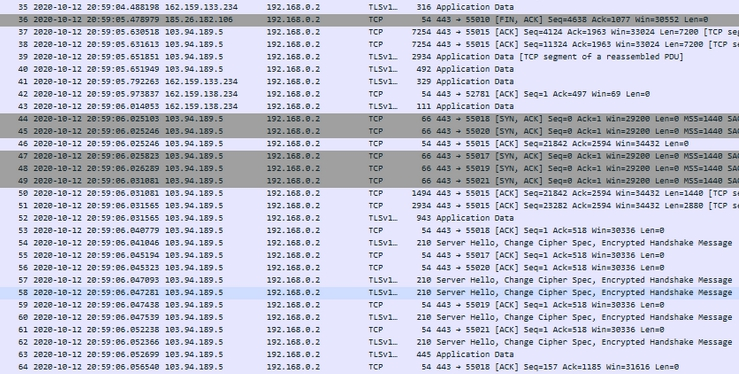

**Soal 14**
> Filter sehingga wireshark hanya mengambil paket yang berasal dari ip kalian!

Untuk melakukan filter digunakan perintah


```
src 192.168.0.2
```

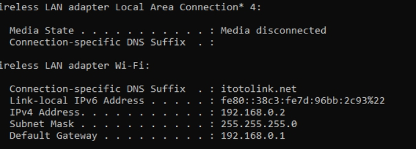
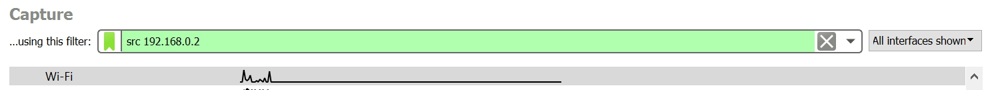
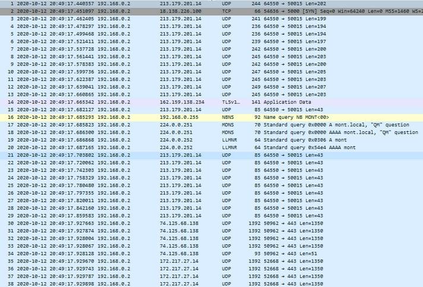


**Soal 15**
> Filter sehingga wireshark hanya mengambil paket yang tujuannya ke monta.if.its.ac.id!

Untuk melakukan filter digunakan perintah

```
dst monta.if.its.ac.id
```

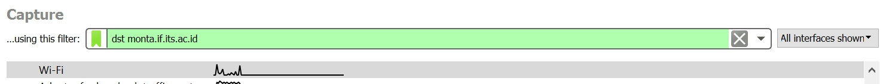
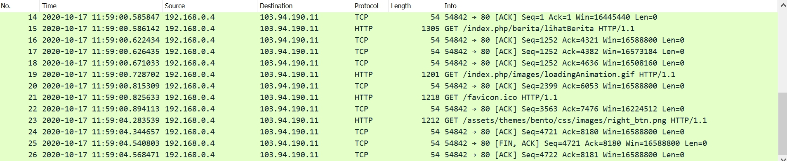
