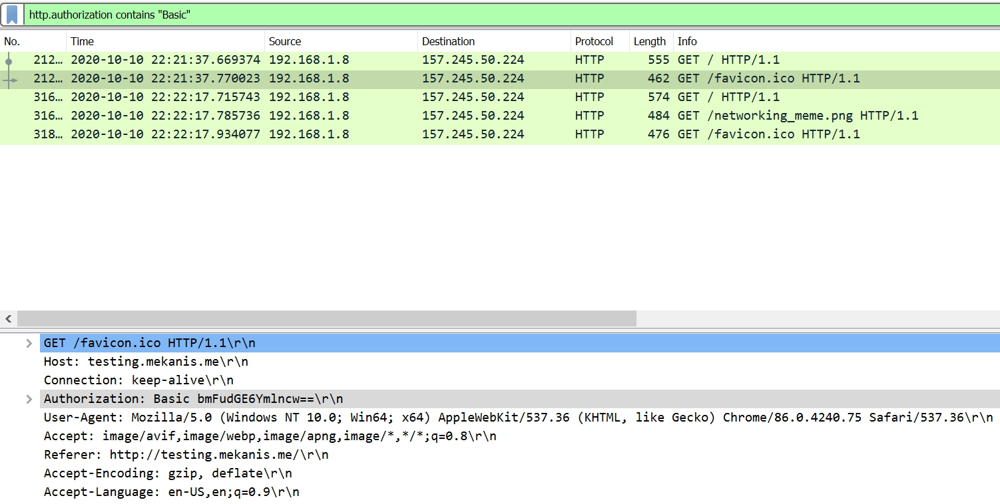

# Jarkom_Modul1_Lapres_B04
Kelompok B04
- Syubban Fakhriya 05111840000042
- Feraldy Nathanael 05111840000166

**Soal 1**
> Sebutkan webserver yang digunakan pada "testing.mekanis.me"!

Filter paket yang berasal atau menuju testing.mekanis.me dengan sintaks

```
http.post == "testing.mekanis.me"
```
Kemudian klik kanan pada salah satu paket kemudian klik follow -> tcp stream


Webserver tertulis dengan nama server sebagai berikut


```
Server: nginx/1.14.0 (Ubuntu)
```

**Soal 2**
> Simpan gambar "Tim_Kunjungan_Kerja_BAKN_DPR_RI_ke_Sukabumi141436.jpg"!

**Soal 3**
> Cari username dan password ketika login di "ppid.dpr.go.id"!

Untuk soal ini kita lakukan filter dengan sintaks
```
http.post == "ppid.dpr.go.id"
```
karena kita mencari username dan password (http method post), kita gabung sintaksnya untuk melakukan filter http dan method post maka sintaks akan menjadi

```
http.post == "ppid.dpr.go.id" && http.request.method == "POST"
```


Informasi mengenai login didapat melalui detail paket seperti berikut


**Soal 4**
> Temukan paket dari web-web yang menggunakan basic authentication method!

Untuk melakukan filter digunakan sintaks

```
http.authorization contains "Basic"
```



**Soal 5**
> Ikuti perintah di aku.pengen.pw! Username dan password bisa didapatkan dari file .pcapng!

**Soal 6**
> Seseorang menyimpan file zip melalui FTP dengan nama "Answer.zip". Simpan dan Buka file "Open This.pdf" di Answer.zip. Untuk mendapatkan password zipnya, temukan dalam file zipkey.txt (passwordnya adalah isi dari file txt tersebut).

**Soal 7**
> Ada 500 file zip yang disimpan ke FTP Server dengan nama 1.zip, 2.zip, ..., 500.zip. Salah satunya berisi pdf yang berisi puisi. Simpan dan Buka file pdf tersebut.
Your Super Mega Ultra Rare Hint = nama pdf-nya "Yes.pdf"

**Soal 8**
> Cari objek apa saja yang didownload (RETR) dari koneksi FTP dengan Microsoft FTP Service!

**Soal 9**
> Cari username dan password ketika login FTP pada localhost!

**Soal 10**
> Cari file .pdf di wireshark lalu download dan buka file tersebut!
clue: "25 50 44 46" 

**Soal 11**
> Filter sehingga wireshark hanya mengambil paket yang mengandung port 21!

**Soal 12**
> Filter sehingga wireshark hanya mengambil paket yang berasal dari port 80!

**Soal 13**
> Filter sehingga wireshark hanya menampilkan paket yang menuju port 443!

**Soal 14**
> Filter sehingga wireshark hanya mengambil paket yang berasal dari ip kalian!

**Soal 15**
> Filter sehingga wireshark hanya mengambil paket yang tujuannya ke monta.if.its.ac.id!